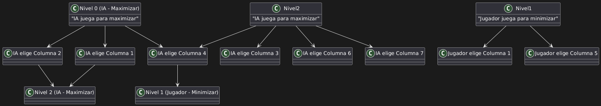

# Conecta Cuatro - Juego con IA
Nombre: Mauricio Javier Muñoz Guerrero;
RUT: 21.542.213-5;
Correo: mauricio.munoz01@alumnos.ucn.cl;
Paralelo: C2;
Fecha: 09/12/2024;

Este proyecto implementa el clásico juego **Conecta Cuatro** donde el jugador juega contra la inteligencia artificial utilizando el algoritmo **Minimax** con **poda alfa-beta** para decidir los movimientos de la IA.

## Instrucciones para ejecutar el programa

1. Clona el repositorio en tu máquina local:
    ```bash
    git clone https://github.com/MauConfort/Taller2C-.git
    ```
2. Ingresa al directorio del proyecto:
    ```bash
    cd conecta-cuatro
    ```
3. Compila el código:
    ```bashC
    g++ -o conectaCuatro src/ConectaCuatro.cpp
    ```
4. Ejecuta el programa:
    ```bash
    ./conectaCuatro
    ```
5. El jugador puede modificar el archivo `Jugador.txt` para agregar los movimientos, con la opción de escribir los movimientos manualmente si el archivo se queda sin movimientos.

## Explicaciones sobre el algoritmo utilizado

### Algoritmo Minimax

El algoritmo **Minimax** es un algoritmo de búsqueda utilizado en juegos de dos jugadores, donde un jugador intenta maximizar su puntuación (IA) mientras que el otro jugador (humano) intenta minimizar la puntuación del oponente. En este caso, la IA juega para maximizar su puntuación y bloquear las jugadas del jugador.

### Poda Alfa-Beta

La **poda alfa-beta** es una optimización del algoritmo Minimax que mejora la eficiencia al reducir la cantidad de nodos evaluados en el árbol de decisiones. Utiliza dos valores, **alfa** y **beta**, para descartar ramas del árbol que no pueden influir en la decisión final.

## Explicación del juego

- **Objetivo**: El objetivo es ser el primero en conectar 4 fichas en línea (horizontal, vertical o diagonal).
- **Movimiento**: En cada turno, el jugador o la IA deben elegir una columna entre 1 y 7. Las fichas se colocan en la columna seleccionada, y la primera fila disponible se llena con la ficha.

## Diagrama del árbol de juego para un caso simple (ejemplo: primeros 3 movimientos)

Aquí se muestra un ejemplo básico de cómo se construye el árbol de decisiones para los primeros movimientos en el juego.


Este árbol ilustra cómo se evaluan las decisiones posibles tanto para el jugador como para la IA en función de la situación del tablero.

## Análisis de complejidad temporal del algoritmo, antes y después de aplicar la poda

### Complejidad temporal sin poda

El algoritmo Minimax tiene una complejidad de `O(b^d)`, donde `b` es el número de movimientos posibles en cada turno y `d` es la profundidad máxima del árbol de decisiones. Para juegos complejos, esta complejidad puede hacer que la ejecución sea lenta, ya que el árbol crece exponencialmente.

### Complejidad temporal con poda alfa-beta

La **poda alfa-beta** mejora significativamente la eficiencia del algoritmo, reduciendo la complejidad temporal a `O(b^(d/2))`. Esto se debe a que la poda descarta ramas que no pueden afectar el resultado del juego, evitando la exploración innecesaria de nodos y permitiendo que el algoritmo sea más rápido.

## Notas adicionales

1. **Archivos de entrada**:
   - El programa lee los movimientos del jugador desde un archivo de texto llamado `Jugador.txt`. Si este archivo se queda vacío, el jugador podrá ingresar manualmente sus movimientos a través de la consola.
2. **Interfaz del juego**:
   - El juego muestra un tablero con las fichas de los jugadores representadas por "O" (jugador) y "X" (IA). El jugador selecciona las columnas en las que quiere colocar sus fichas.
   
3. **Instrucciones**:
   - El jugador puede elegir una columna entre 1 y 7 para colocar su ficha.
   - La IA juega utilizando el algoritmo Minimax con poda alfa-beta.

## Agradecimientos

Gracias por utilizar este programa. ¡Diviértete jugando a Conecta Cuatro!


